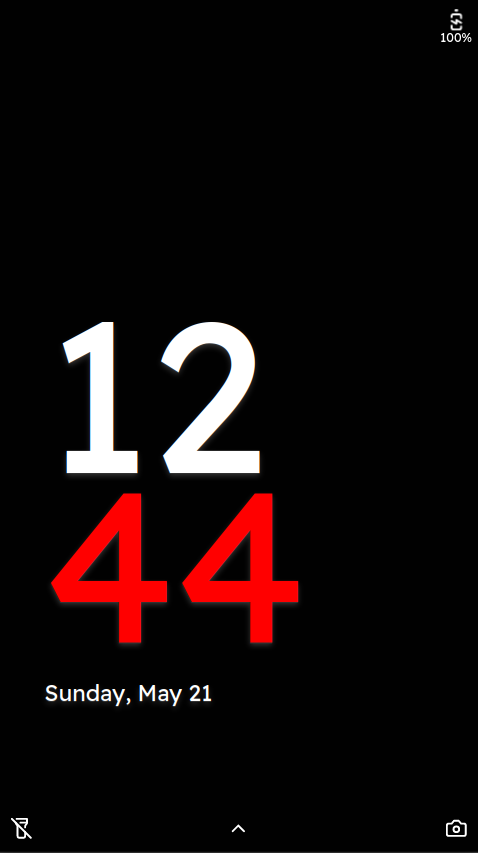
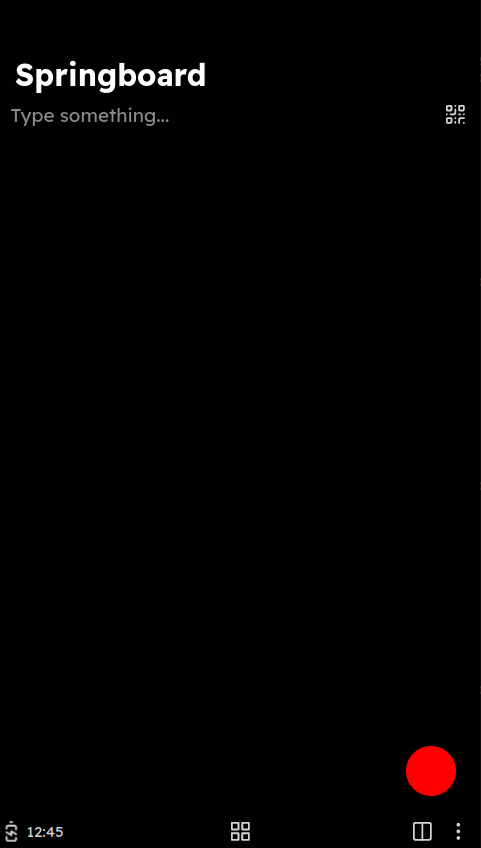
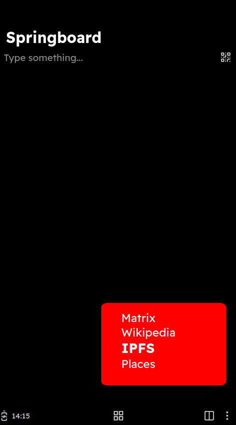

# Volla home: A Volla styled homescreen for Capyloon / Nutria

Volla home is aiming to provide the user experience of the Springboard from Volla OS for Capyloon.

The Volla launcher offers the following attributes:
- Springpoint: Fast access to favorite Apps
- Springboard: Integrated functions
  - Search Contacts
  - Search the web
  - run apps
  - save notes

# About
This project was initially created during the volla hackathon 2023. 
Volla is a phone brand based in Germany, creating an open and free operating system for their own sustainable Android device called Volla Phone. You can find them in the web: https://www.volla.online/ 
Once a year a community of hackers and enthusiasts are gathering to develop ideas and programs during a hackathon hosted by Hallo Welt Systeme, the manufacturer of Volla Devices.

Capyloon is a project to bring back the Firefox OS base to modern devices.

Since the idea of a free and clean operating system like Volla OS matches perfectly with the puristic UX of Capyloon, Vollahome aims to combine the look and feel of Volla with the Capyloon base. 
Vollahome is a winner of the hackathon 2023. You can get an impression of the presentation at the <a href="https://www.youtube.com/watch?v=gAc3fA1edW4&t=17725s" target="_BLANK">stream recording of the Volla Community days on Youtube.</a>

# Installation
This app is currently in an early state of development. If you want to try the user experience on your device / nutria instance please follow this guidance:

- Download the latest release or clone this repository
- Copy the vollahome folder to your nutria instance
- run ./jackady push vollahome

# Further Links
- Capyloon: https://www.capyloon.org
- Volla: https://www.volla.online/
- Nutria: https://www.github.com/capyloon/nutria